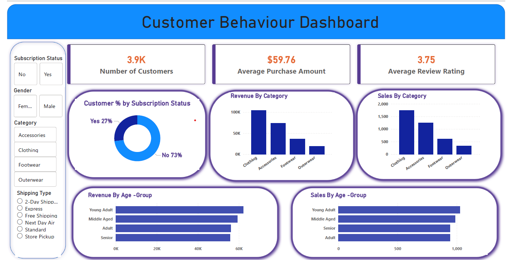

# Customer Shopping Behaviour Analysis

## 📌 Project Overview
This project analyzes customer shopping behaviour using transactional retail data to uncover insights related to **spending patterns, customer segments, discount usage, subscription impact, and product performance**.  
The analysis supports **data-driven business decision-making** through SQL-based insights and an interactive Power BI dashboard.

---

## 📊 Dataset Summary
- **Total Records:** 3,900 customer purchases  
- **Total Features:** 18 columns  

### Key Data Categories
- **Customer Demographics:** Age group, gender, location, subscription status  
- **Purchase Details:** Item purchased, category, purchase amount, season, size, color  
- **Shopping Behaviour:** Discount usage, promo codes, previous purchases, frequency, review ratings, shipping type  

### Data Quality Notes
- 37 missing values in the `review_rating` column  
- Missing values were handled during preprocessing in Python  

---

## 🔍 Exploratory Data Analysis (Python)
Initial data exploration and cleaning were performed in **Jupyter Notebook**, including:
- Handling missing values  
- Data type corrections  
- Summary statistics and distribution checks  
- Feature validation prior to database ingestion  

📓 Notebooks:
- `Customer_behaviour.ipynb` – Data cleaning & EDA  
- `SQL_Connection.ipynb` – PostgreSQL connection & data loading  

---

## 🛢️ Database & SQL Analysis
Cleaned data was loaded into **PostgreSQL**, and business questions were answered using **SQL queries** focusing on:

- Revenue contribution by gender  
- Impact of discounts on high-value purchases  
- Product satisfaction vs. purchase volume  
- Shipping type vs. customer spend  
- Subscription influence on revenue and repeat purchases  
- Customer lifecycle segmentation  
- Product performance by category  
- Revenue contribution by age group  

📄 SQL File:
- `Customer_behaviour_analysis.sql`

---

## 📈 Power BI Dashboard
An interactive **Power BI dashboard** was created to visualize key findings and trends, including:
- Revenue distribution by gender and age group  
- Subscription vs non-subscription performance  
- Discount-driven purchasing behavior  
- Product and category-level insights  
- Customer segmentation overview  

### 📷 Dashboard Preview

> The dashboard provides a high-level executive view complementing the detailed SQL and Python analysis.

---

## 🧾 Report
A detailed analytical report documenting **methodology, queries, results, and interpretations** was written in LaTeX.

📄 Report File:
- `Customer_Analysis.pdf`

---

## 🛠️ Tools & Technologies
- **Python:** Pandas, NumPy, Jupyter Notebook  
- **Database:** PostgreSQL  
- **Visualization:** Power BI  
- **Query Language:** SQL  
- **Reporting:** LaTeX  
- **Version Control:** Git & GitHub  

---

## 📁 Project Structure

customer_behaviour_Analysis/
├── Customer_behaviour.ipynb
├── SQL_Connection.ipynb
├── Customer_behaviour_analysis.sql
├── Customer_Analysis.pdf
├── power_bi_dashboard.png
├── README.md

🚀 Key Takeaways
- Male customers contribute higher total revenue primarily due to higher transaction volume  
- Discounts are more frequently used in lower-to-mid value purchases  
- Subscription status does not significantly increase average spend but affects retention  
- Loyal customers form the largest segment, highlighting strong retention  
- Certain products rely heavily on discount-driven sales, indicating price sensitivity  

